>First part of this notebook based on Karthik Ram's [GGPLOT2 Lecture](https://github.com/karthik/ggplot-lecture) ([CC-By 2.0](https://creativecommons.org/licenses/by/2.0/))
>Also includes

GOALS: Learners should be able to use ggplot2 to generate publication quality graphics and understand and use the basics of the grammar of graphics.

Let's load the tidyverse using the `library()` function. If you haven't installed `tidyverse`, install it now:


~~~
library(tidyverse)
~~~
{: .r}


~~~
Loading tidyverse: tibble
Loading tidyverse: tidyr
Loading tidyverse: readr
Loading tidyverse: purrr
Loading tidyverse: dplyr
~~~
{: .output}


~~~
Conflicts with tidy packages ----------------------------------------------
~~~
{: .output}


~~~
filter(): dplyr, stats
lag():    dplyr, stats
~~~
{: .output}

>## KEY TERMS FOR DATA TYPES
>**Continuous**
>* Data that can take on any value in an interval.
>* Synonyms
>   * interval, float, numeric
>
>**Discrete**
>* Data that can take on only integer values, such as counts.
>* Synonyms
>   * integer, count
>
>**Categorical**
>* Data that can take on only a specific set of values representing a set of possible categories.
>* Synonyms
>   * enums, enumerated, factors, nominal, polychotomous
>
>**Binary**
>* A special case of categorical data with just two categories of values (0/1, true/false).
>* Synonyms
>   * dichotomous, logical, indicator, boolean
>
>**Ordinal**
>* Categorical data that has an explicit ordering.
>* Synonyms
>   * ordered factor
> --From [*Practical Statistics for Data Scientists*](http://shop.oreilly.com/product/0636920048992.do) by Andrew & Peter Bruce
{: .callout}

* Why does data type matter in the context of Data Visualization?

## GGPLOT2

* GGPLOT2 developed by Hadley Wickham based on the *grammar-of-graphics*
* **Grammar of graphics** consists of a **dataset**, **coordinate system**, and **geoms** -- the visual representation of data points.
* Think about figure in layers:  like you would in Photoshop, illustrator or Inkscape.

## Data Viz

* Plotting our data is one of the best ways to quickly explore it and the various relationships between variables
* 3 main plotting systems in R: the base [plotting system](http://www.statmethods.net/graphs/), the [lattice package](http://www.statmethods.net/advgraphs/trellis.html), and [ggplot2](http://www.statmethods.net/advgraphs/ggplot2.html)
* `ggplot2` is built on the *grammar-of-graphics* first articulated by [Leland Wilkinson](https://www.amazon.com/Grammar-Graphics-Statistics-Computing/dp/0387987746) in 1999:
   * idea that any plot can be expressed from the same set of components: a **data set**, a **coodinate system** and a set of **geoms** (geometries)-- the visual representation of data points
* **Key** to understanding `ggplot2` is thinking about a figure in layers -- think of ArcGIS or programs like Photoshop

## Terminology:

* **ggplot** - The main function where you specify the dataset and variables to plot
* **geoms** - geometric objects
  * `geom_point()`, `geom bar()`, `geom density()`, `geom line()`, `geom area()`
* **aes** - aesthetics
  * shape, transparency (alpha), color, fill, line-type.
* **scales** Define how your data will be plotted
  * continuous, discrete, log

---

## First Plots with GGPLOT

This famous (Fisher's or Anderson's) iris data set gives the measurements in centimeters of the variables sepal length and width and petal length and width, respectively, for 50 flowers from each of 3 species of iris. The species are Iris setosa, versicolor, and virginica.


~~~
library(ggplot2)
head(iris)
~~~
{: .r}


~~~
  Sepal.Length Sepal.Width Petal.Length Petal.Width Species
1          5.1         3.5          1.4         0.2  setosa
2          4.9         3.0          1.4         0.2  setosa
3          4.7         3.2          1.3         0.2  setosa
4          4.6         3.1          1.5         0.2  setosa
5          5.0         3.6          1.4         0.2  setosa
6          5.4         3.9          1.7         0.4  setosa
~~~
{: .output}

WE can use the `data()` function to show the available built-in data sets in R.


~~~
data()
~~~
{: .r}


~~~
ggplot(data = iris, aes(x = Sepal.Length, y = Sepal.Width)) +
  geom_point()
~~~
{: .r}

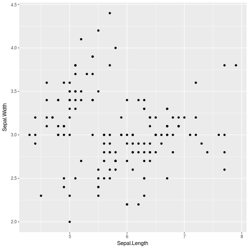

**Basic structure**


~~~
ggplot(data = iris, aes(x = Sepal.Length, y = Sepal.Width)) + geom_point()
~~~
{: .r}

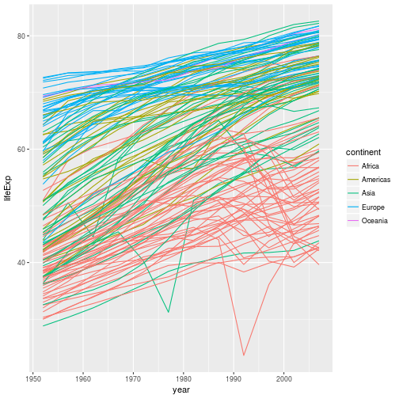

~~~
myplot <- ggplot(data = iris, aes(x = Sepal.Length, y = Sepal.Width))
myplot + geom_point()
~~~
{: .r}


* Specify the **data and variables** inside the `ggplot` function.
* Anything else that goes in here becomes a global setting.
* Then add layers of geometric objects, statistical models, and panels.

**Increase size of points**


~~~
ggplot(data = iris, aes(x = Sepal.Length, y = Sepal.Width)) +
  geom_point(size = 3)
~~~
{: .r}

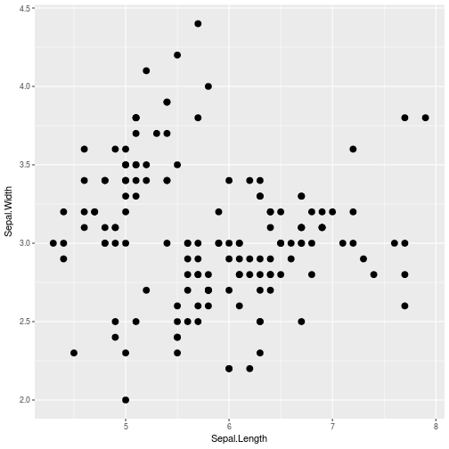

**Make it colorful**

~~~
ggplot(iris, aes(Sepal.Length, Sepal.Width, color = Species)) +
  geom_point(size = 3)
~~~
{: .r}

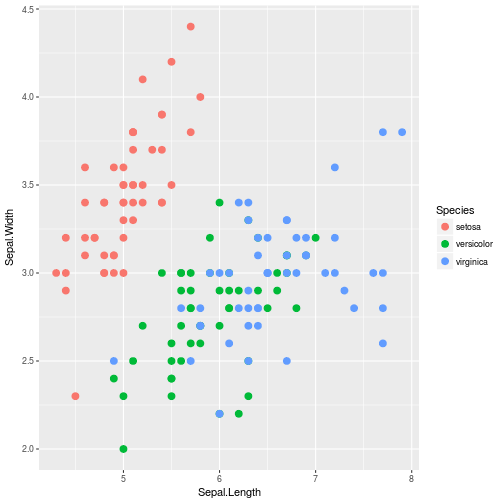

**Differentiate points by shape**


~~~
ggplot(iris, aes(Sepal.Length, Sepal.Width, color = Species)) +
  geom_point(aes(shape = Species), size = 3)
~~~
{: .r}

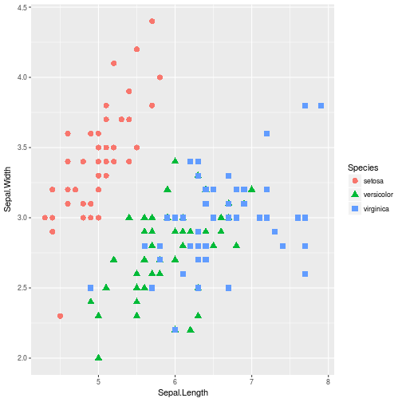

### Exercise 1

* Let's use the `diamonds` dataset that is installed with the `ggplot2` package.
* Since `diamonds` has 50K+ diamonds, let's make a smaller sample of the diamonds dataset.


~~~
d2 <- diamonds[sample(1:dim(diamonds)[1], 1000), ]
~~~
{: .r}

Knowing what you know about ggplot, can you fill in the blanks to make this figure from `d2`:


~~~
ggplot(d2, aes(carat, _____, color = _____)) + geom_point() + theme_gray()
~~~
{: .r}

##Solution
```
{r answer-ex-1}
ggplot(d2, aes(carat, price, color = color)) + geom_point() + theme_gray()
```

## Box plots

See `?geom_boxplot` for list of options


~~~
library(MASS)
~~~
{: .r}


~~~

Attaching package: 'MASS'
~~~
{: .output}


~~~
The following object is masked from 'package:dplyr':

    select
~~~
{: .output}


~~~
head(birthwt)
~~~
{: .r}


~~~
   low age lwt race smoke ptl ht ui ftv  bwt
85   0  19 182    2     0   0  0  1   0 2523
86   0  33 155    3     0   0  0  0   3 2551
87   0  20 105    1     1   0  0  0   1 2557
88   0  21 108    1     1   0  0  1   2 2594
89   0  18 107    1     1   0  0  1   0 2600
91   0  21 124    3     0   0  0  0   0 2622
~~~
{: .output}


~~~
ggplot(birthwt, aes(factor(race), bwt)) + geom_boxplot()
~~~
{: .r}

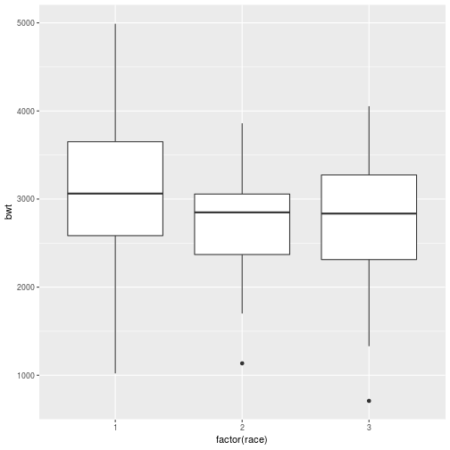


## Histograms

See `?geom_histogram` for list of options


~~~
h <- ggplot(faithful, aes(x = waiting))
h + geom_histogram(binwidth = 30, colour = "black")
~~~
{: .r}

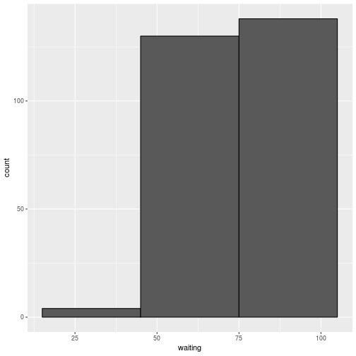

* Notice that we created a `ggplot` object by saving it to `h`
* We can workout certain set-up aspects for our plot as an object, then iteratively try different types of `geoms`
* Adding color and adjusting the binwidth


~~~
h <- ggplot(faithful, aes(x = waiting))
h + geom_histogram(binwidth = 8, fill = "steelblue", colour = "black")
~~~
{: .r}

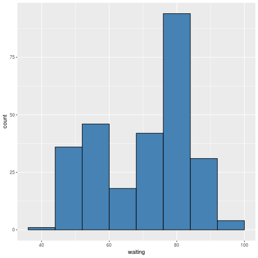

## Line plots

## Gapminder line graph

Using scatter plot not the best way to visualize change over time. Let's use line plot.


~~~
ggplot(data = gapminder, aes(x=year, y=lifeExp, by=country, color=continent)) +
  geom_line()
~~~
{: .r}


* used geom_line instead of geom_point
* added a **by** *aesthetic* to get a line per country and color by continent


* visualize both lines and points on the plot?


~~~
ggplot(data = gapminder, aes(x=year, y=lifeExp, by=country, color=continent)) +
  geom_line() + geom_point()
~~~
{: .r}


* note this is layered: so points have been drawn on top of the lines.
* example of this


~~~
ggplot(data = gapminder, aes(x=year, y=lifeExp, by=country)) +
  geom_line(aes(color=continent)) + geom_point()
~~~
{: .r}

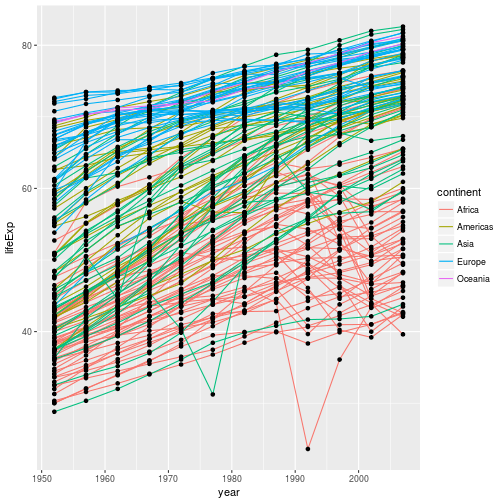

* the *aesthetic* mapping of **color** has been moved from the
global plot options in `ggplot` to the `geom_line` layer so it no longer applies to the points

### Challenge 3

<http://swcarpentry.github.io/r-novice-gapminder/08-plot-ggplot2#challenge-3>

## Bar Plots


~~~
ggplot(iris, aes(Species, Sepal.Length)) +
  geom_bar(stat = "identity")
~~~
{: .r}

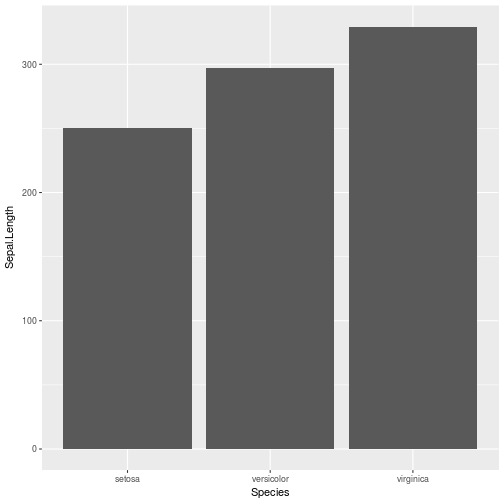

The heights of the bars commonly represent one of two things: either a **count of cases in each group**, or the values in a column of the data frame. By default, geom_bar uses stat="bin". This makes the height of each bar equal to the number of cases in each group, and it is incompatible with mapping values to the y aesthetic. If you want the heights of the bars to represent values in the data, use stat="identity" and map a value to the y aesthetic.

## Dplyr and Tidyr

These two packages are the Swiss army knives of R. They are loaded when we load the `tidyverse`.

**dplyr**
* filter
* select
* mutate

**tidyr**

* gather
* spread
* separate   

Let's look at iris again.


~~~
iris[1:2, ]
~~~
{: .r}


~~~
  Sepal.Length Sepal.Width Petal.Length Petal.Width Species
1          5.1         3.5          1.4         0.2  setosa
2          4.9         3.0          1.4         0.2  setosa
~~~
{: .output}


~~~
df <- gather(iris, variable, value, -Species )
~~~
{: .r}


~~~
df[1:2, ]
~~~
{: .r}


~~~
  Species     variable value
1  setosa Sepal.Length   5.1
2  setosa Sepal.Length   4.9
~~~
{: .output}


~~~
ggplot(df, aes(Species, value, fill = variable)) +
  geom_bar(stat = "identity", position = "dodge")
~~~
{: .r}

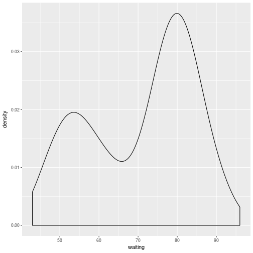


### Exercise 3
Using the d2 dataset you created earlier, position the bars side by side below like you did above. Fill in the blank:


**fill in the blank**


~~~
d2 <- diamonds[sample(1:dim(diamonds)[1], 1000), ]#we will create the `d2` again for convenience
ggplot(d2, aes(clarity, fill = cut)) +
  geom_bar(____________)
~~~
{: .r}
* What if you wanted to stack them instead?(hint: the position name is 'stacked')
*

~~~
d2 <- diamonds[sample(1:dim(diamonds)[1], 1000), ]#we will create the `d2` again for convenience
ggplot(d2, aes(clarity, fill = cut)) +
  geom_bar(____________)
~~~
{: .r}

## Density Plots


~~~
ggplot(faithful, aes(waiting)) + geom_density()
~~~
{: .r}

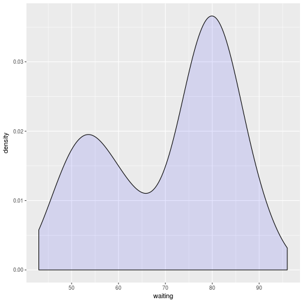


~~~
ggplot(faithful, aes(waiting)) +
  geom_density(fill = "blue", alpha = 0.1)
~~~
{: .r}

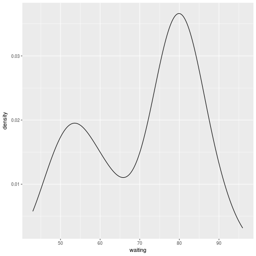


~~~
ggplot(faithful, aes(waiting)) +
  geom_line(stat = "density")
~~~
{: .r}


## Colors


~~~
aes(color = variable)
aes(color = "black")
# Or add it as a scale
scale_fill_manual(values = c("color1", "color2"))
~~~
{: .r}

~~~
library(RColorBrewer)
display.brewer.all()
~~~
{: .r}


### Using a color brewer palette


~~~
#df  <- melt(iris, id.vars = "Species")
ggplot(df, aes(Species, value, fill = variable)) +
  geom_bar(stat = "identity", position = "dodge") +
  scale_fill_brewer(palette = "Set1")
~~~
{: .r}

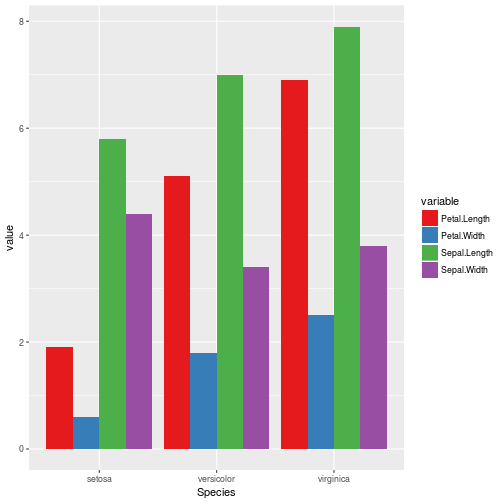

### Manual color scale

~~~
ggplot(iris, aes(Sepal.Length, Sepal.Width, color = Species)) +
geom_point() +
facet_grid(Species ~ .) +
scale_color_manual(values = c("red", "green", "blue"))
~~~
{: .r}

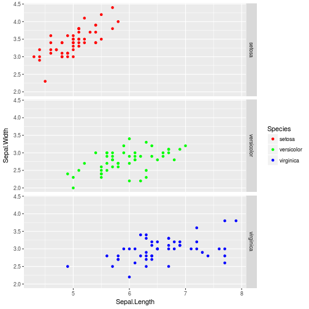


## Transformations and statistics

* overlay statistical models over the data
* let's use our first example


~~~
ggplot(data = gapminder, aes(x = lifeExp, y = gdpPercap, color=continent)) +
  geom_point()
~~~
{: .r}

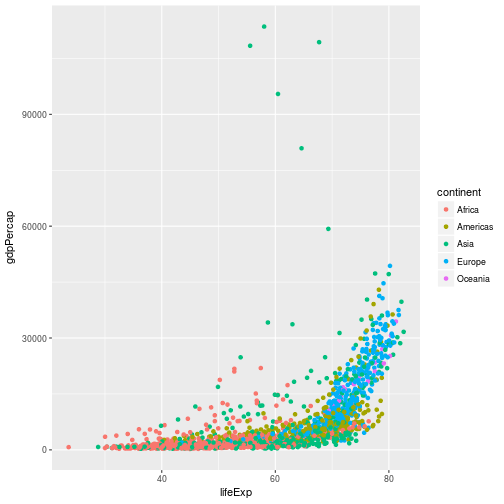

* hard to see relationships b/t points because of strong outliers in GDP/cap
* We can change the scale of units on the `y` axis using the *scale* functions
* These control the mapping between the data values and visual values of an aesthetic.
* We'll also use the `alpha` function, which is helpful when you have a large amount of data which is v. clustered


~~~
ggplot(data = gapminder, aes(x = lifeExp, y = gdpPercap)) +
  geom_point() + scale_y_log10()
~~~
{: .r}

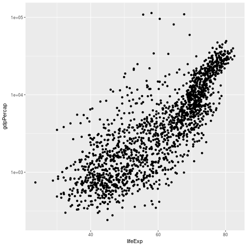

* `log10` function applied a transformation to the values of the gdpPercap column before rendering them on the plot
   * each multiple of 10 now only corresponds to an increase in 1 on the transformed scale, e.g. a GDP per capita
of 1,000 is now 3 on the y axis, a value of 10,000 corresponds to 4 on the y axis and so on
* This makes it easier to visualize the spread of data on the y-axis.

* We can fit a simple relationship to the data by adding another layer, `geom_smooth`:


~~~
ggplot(data = gapminder, aes(x = lifeExp, y = gdpPercap)) +
  geom_point() + scale_y_log10() + geom_smooth(method="lm")
~~~
{: .r}

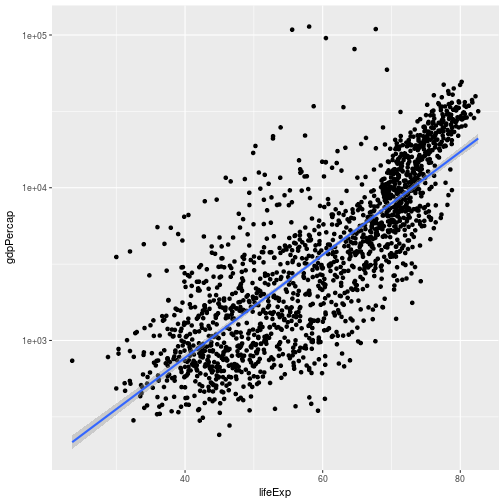

*  make the line thicker by *setting* the **size** aesthetic in the `geom_smooth` layer:


~~~
pwd <- ggplot(data = gapminder, aes(x = lifeExp, y = gdpPercap)) +
  geom_point() + scale_y_log10() + geom_smooth(method="lm", size=1.5)
~~~
{: .r}

* Two ways an *aesthetic* can be specified:
  1. Here we *set* the **size** aesthetic by passing it as an argument to `geom_smooth`.
  2. use the `aes` function to define a *mapping* between data variables and their visual representation.

### Challenge 4a

Modify the color and size of the points on the point layer in the previous example.

Hint: do not use the `aes` function.

**fill in blank and run**


~~~
ggplot(data = gapminder, aes(x = gdpPercap, y = lifeExp)) +
  geom_point(____, ____) + scale_x_log10() +
  geom_smooth(method="lm", size=1.5)
~~~
{: .r}

## Solution to challenge 4a

Modify the color and size of the points on the point layer in the previous
 example.

Hint: do not use the `aes` function.


~~~
ggplot(data = gapminder, aes(x = gdpPercap, y = lifeExp)) +
  geom_point(size=3, color="orange") + scale_x_log10() +
  geom_smooth(method="lm", size=1.5)
~~~
{: .r}

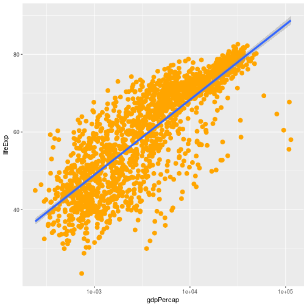

### Challenge 4b

Try challenge 4B on the Software Carpentry site:

<http://swcarpentry.github.io/r-novice-gapminder/08-plot-ggplot2#challenge-3#challenge-4b>

## Multi-panel figures: FACEting

* we can split this out over multiple panels by adding a layer of **facet** panels:


~~~
starts.with <- substr(gapminder$country, start = 1, stop = 1)
az.countries <- gapminder[starts.with %in% c("A", "Z"), ]
ggplot(data = az.countries, aes(x = year, y = lifeExp, color=continent)) +
  geom_line() + facet_wrap( ~ country)
~~~
{: .r}

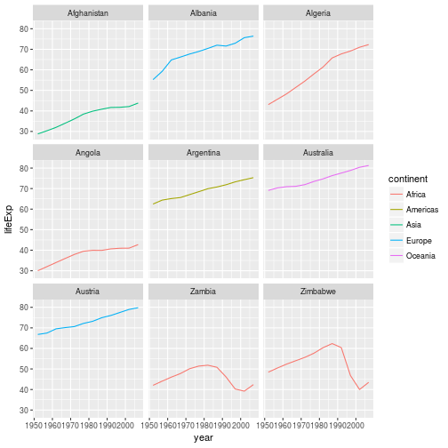

* `facet_wrap` layer took a "formula" as its argument, denoted by the tilde
(~).
* tells R to draw a panel for each unique value in the country column
of the gapminder dataset.

## Modifying text

* would like to add text to elements in the graph
* do this by adding a few more layers:
   * **theme** layer controls axis text & text size
   * **scales** layer to change legend title


~~~
ggplot(data = az.countries, aes(x = year, y = lifeExp, color=continent)) +
  geom_line() + facet_wrap( ~ country) +
  xlab("Year") + ylab("Life expectancy") + ggtitle("Figure 1") +
  scale_colour_discrete(name="Continent") +
  theme(axis.text.x=element_blank(), axis.ticks.x=element_blank())
~~~
{: .r}

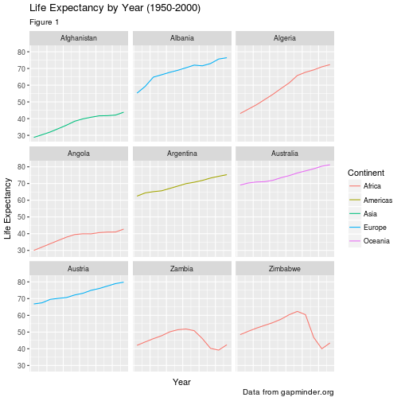

## Challenge 5

Create a density plot of GDP per capita, filled by continent.

Advanced:
- Transform the x axis to better visualise the data spread.
- Add a facet layer to panel the density plots by year.

Create a density plot of GDP per capita, filled by continent.

**Fill in blank**


~~~
ggplot(data = gapminder, aes(x = _____, fill=_____)) +
  geom_density(alpha=0.6) + facet_wrap( ~ year) + scale_x____()
``

## Solution to challenge 5

Create a density plot of GDP per capita, filled by continent.

Advanced:
- Transform the x axis to better visualise the data spread.
- Add a facet layer to panel the density plots by year.
~~~
{: .r}

~~~
ggplot(data = gapminder, aes(x = gdpPercap, fill=continent)) +
 geom_density(alpha=0.6) + facet_wrap( ~ year) + scale_x_log10()
``

## Themes

Themes are a great way to define custom plots.

+theme()

**see ?theme() for more options**

~~~
{: .r}


~~~
Error: attempt to use zero-length variable name
~~~
{: .error}

~~~
ggplot(iris, aes(Sepal.Length, Sepal.Width, color = Species)) +
  geom_point(size = 1.2, shape = 16) +
  facet_wrap( ~ Species) +
    theme(legend.key = element_rect(fill = NA),
    legend.position = "bottom",
    strip.background = element_rect(fill = NA),
    axis.title.y = element_text(angle = 0))
~~~
{: .r}

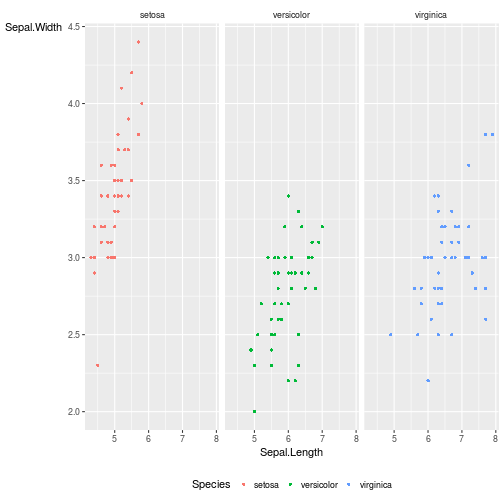

**And for even more fun:**


~~~
#install.packages('ggthemes')
library(ggthemes)
~~~
{: .r}

## Then add one of these themes to your plot
 + `theme_stata()`
 + `theme_excel()`
 + `theme_wsj()`
 + `theme_solarized()`


~~~
ggplot(iris, aes(Sepal.Length, Sepal.Width, color = Species)) +
  geom_point(size = 1.2, shape = 16) +
  facet_wrap( ~ Species) +
  theme_solarized() +
  theme(legend.key = element_rect(fill = NA),
    legend.position = "bottom",
    strip.background = element_rect(fill = NA),
    axis.title.y = element_text(angle = 0))
~~~
{: .r}

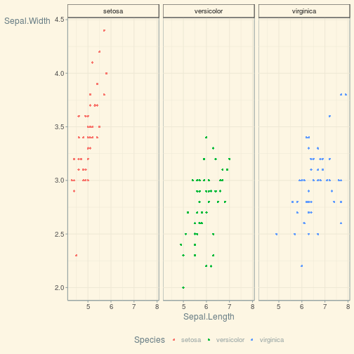

## How to save your plots


~~~
ggsave('~/path/to/figure/filename.png')
ggsave(plot1, file = "~/path/to/figure/filename.png")
~~~
{: .r}


~~~
ggsave(file = "/path/to/figure/filename.png", width = 6,
height =4)
~~~
{: .r}


~~~
ggsave(file = "/path/to/figure/filename.eps")
ggsave(file = "/path/to/figure/filename.jpg")
ggsave(file = "/path/to/figure/filename.pdf")
~~~
{: .r}

## Resources:

This is just a taste of what you can do with `ggplot2`. RStudio provides a
really useful [cheat sheet][cheat] of the different layers available, and more
extensive documentation is available on the [ggplot2 website][ggplot-doc].
Finally, if you have no idea how to change something, a quick Google search will
usually send you to a relevant question and answer on Stack Overflow with reusable
code to modify!

[cheat]: http://www.rstudio.com/wp-content/uploads/2015/03/ggplot2-cheatsheet.pdf
[ggplot-doc]: http://docs.ggplot2.org/current/
