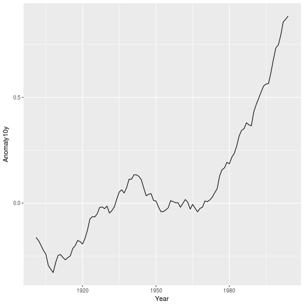
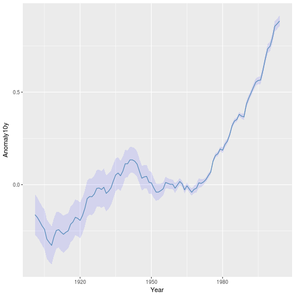
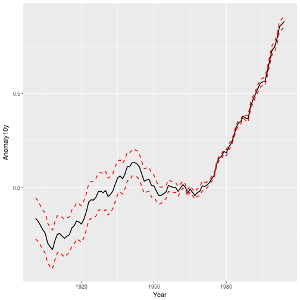
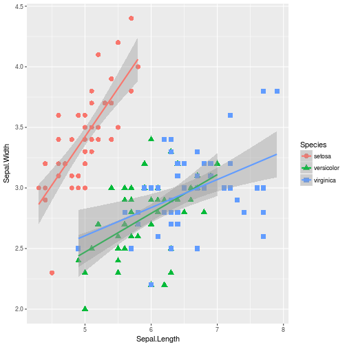
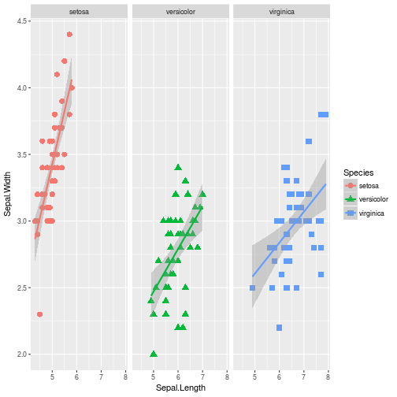
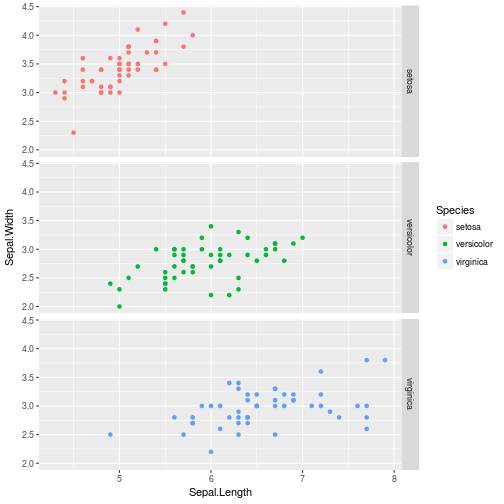
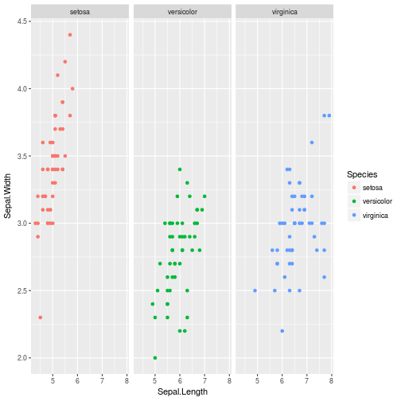
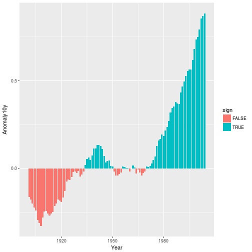

## Line Graphs

**Download climate data first**

~~~
download.file('https://raw.github.com/karthikram/ggplot-lecture/master/climate.csv', 'data/climate.csv')
#climate <- read.csv(text=RCurl::getURL(https://raw.github.com/karthikram/ggplot-lecture/master/climate.csv))
~~~
{: .r}

* In the climate data set, `Anomaly10y` is a 10-year running average of the deviation (in Celsius) from the average 1950–1980 temperature, and `Unc10y` is the 95% confidence interval. We’ll set ymax and ymin to Anomaly10y plus or minus Unc10y (Figure 4-25):

~~~
climate <- read.csv("data/climate.csv", header = T)
ggplot(climate, aes(Year, Anomaly10y)) +
  geom_line()
~~~
{: .r}

**We can also plot confidence regions**

* In the climate data set, `Anomaly10y` is a 10-year running average of the deviation (in Celsius) from the average 1950–1980 temperature, and `Unc10y` is the 95% confidence interval. We’ll set ymax and ymin to Anomaly10y plus or minus Unc10y (Figure 4-25):

~~~
ggplot(climate, aes(Year, Anomaly10y)) +
  geom_ribbon(aes(ymin = Anomaly10y - Unc10y, ymax = Anomaly10y + Unc10y),
              fill = "blue", alpha = .1) +
  geom_line(color = "steelblue")
~~~
{: .r}

### Exercise 2

Modify the previous plot and change it such that there are three lines instead of one with a confidence band.

~~~
cplot <- ggplot(climate, aes(Year, Anomaly10y))
cplot <- cplot + geom_line(size = 0.7, color = "black")
cplot <- cplot + geom_line(aes(Year, Anomaly10y + Unc10y), linetype = "dashed", size = 0.7, color = "red")
cplot <- cplot + geom_line(aes(Year, Anomaly10y - Unc10y), linetype = "dashed", size = 0.7, color = "red")
cplot + theme_gray()
~~~
{: .r}

~~~
#theme_classic
#theme_bw()
#theme_minimal()
~~~
{: .r}

## Transformations and Statistics

### With iris data - add a smooth

~~~
ggplot(iris, aes(Sepal.Length, Sepal.Width, color = Species)) +
  geom_point(aes(shape = Species), size = 3) +
  geom_smooth(method = "lm")
~~~
{: .r}

### Within facet

~~~
ggplot(iris, aes(Sepal.Length, Sepal.Width, color = Species)) +
  geom_point(aes(shape = Species), size = 3) +
  geom_smooth(method = "lm") +
  facet_grid(. ~ Species)
~~~
{: .r}

### With iris along coloumns

~~~
#str(iris)
ggplot(iris, aes(Sepal.Length, Sepal.Width, color = Species)) +
  geom_point() +
  facet_grid(Species ~ .)
~~~
{: .r}

### And along rows

~~~
ggplot(iris, aes(Sepal.Length, Sepal.Width, color = Species)) +
  geom_point() +
  facet_grid(. ~ Species)
~~~
{: .r}

### Or wrap your panels

~~~
ggplot(iris, aes(Sepal.Length, Sepal.Width, color = Species)) +
  geom_point() +
  facet_wrap( ~ Species)
~~~
{: .r}

## Bar Charts

## Exercise 4

* Using the climate dataset, create a new variable called sign. Make it logical (true/false) based on the sign of Anomaly10y.
* Plot a bar plot and use sign variable as the fill.
* HINT: Look up `ifelse` function to create `clim$sign`

~~~
clim <- read.csv('data/climate.csv', header = TRUE)
clim$sign <- ifelse(clim$Anomaly10y<0, FALSE, TRUE)
# or as simple as
# clim$sign <- clim$Anomaly10y < 0
ggplot(clim, aes(Year, Anomaly10y)) + geom_bar(stat = "identity", aes(fill = sign)) + theme_gray()
~~~
{: .r}

